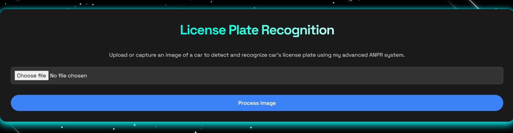
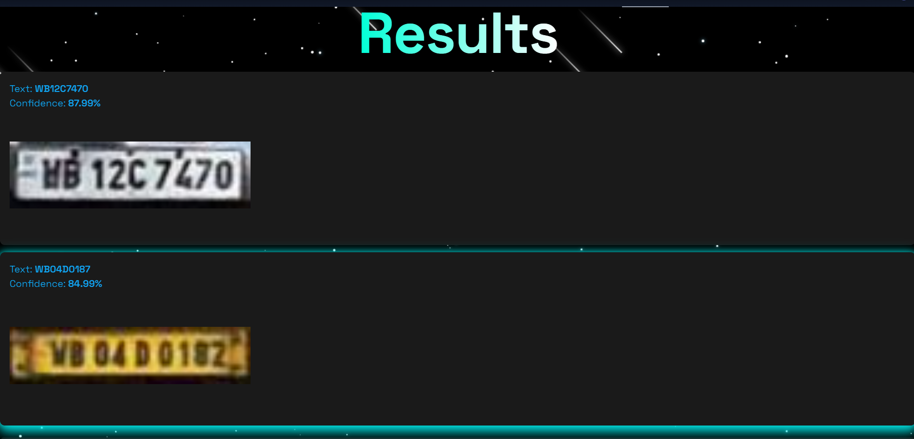

# ANPR Web Application

## Overview
This project is an Automatic Number Plate Recognition (ANPR) system deployed as a web app. It detects and processes license plates from images and video in real time.

## Objectives
- Build a user-friendly interface for plate recognition  
- Integrate ML models with backend APIs and frontend display  
- Enable real-world applications in parking and vehicle management  

## Technologies
- **Python** with ONNX Runtime for inference  
- **YOLO** for license plate detection  
- **Dockerfile** for containerization  
- **Hugging Face Spaces** for deployment  

## Key Implementations
- Trained YOLO OBB model on ~8000 images with data augmentation (rotation, projection distortion).  
- Backend API for plate extraction and RTO/insurance detail fetching (via web scraping).  
- File uploads + live camera support on frontend.  
- Confidence scoring and result display.  

## Challenges & Solutions
- Deployment issues → Solved with Dockerized setup.  
- Performance optimization for real-time inference.  

## Outcomes
- Fully working web app hosted on Hugging Face.  
- Used in parking management systems.  

## Screenshots
- ### Upload your image in **Choose File** option and click **Proceed**

- ### Desired Results: **OCR Value** with **Confidence of Prediction**
  
- ### Overview of how License Plate Detection and Recognition works along with Timestamp and Processing Time 
  
