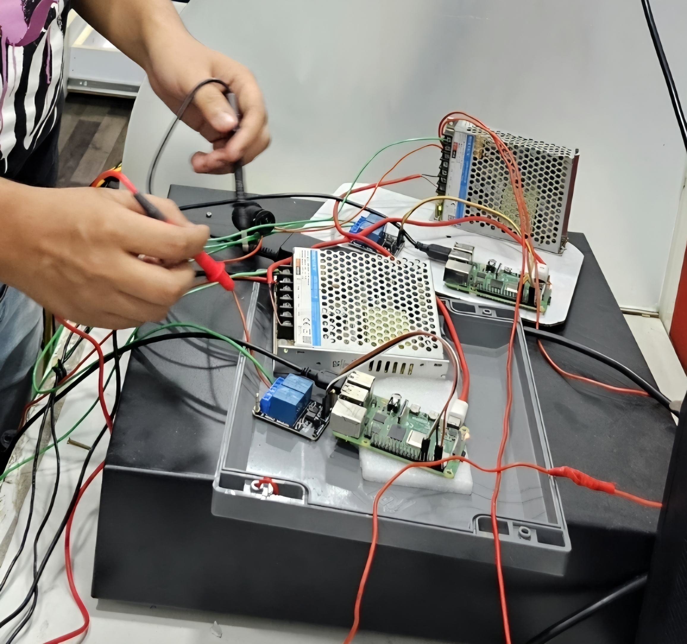

# RFID-Based Parking System with Dual Gates

## Overview
IoT-based parking management solution using RFID, built for entry/exit synchronization and access control.

## Objectives
- Automate barrier control for entry and exit  
- Maintain accurate parking logs with database sync  

## Technologies
- **Raspberry Pi**  
- **RFID readers**  
- **Python scripts** with retry logic (tenacity library)  
- **SQL databases** for record sync  
- **supervisorctl** for service management  

## Key Implementations
- Dual-gate (entry/exit) system with synchronized database.  
- Pseudo-exit logic to handle sync mismatches.  
- Configured **dhcpcd** for networking.  

## Challenges & Solutions
- Sync issues between gates → solved with retry decorators and careful DB design.  

## Outcomes
- Deployed in real-world parking sites.  
- Reliable automated barrier control.  

## Screenshots
- ## Setup with Raspberry Pi and RFID readers
  
